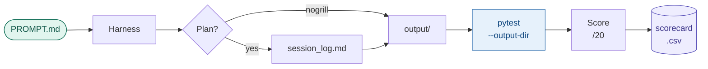

# pathogen-genomics-llm-bench

A structured benchmark for evaluating local large language models (LLMs) on
realistic coding tasks in **pathogen genomics and public health bioinformatics**.

Models are tested via agentic coding harnesses (OpenCode, Claude Code, Codex CLI)
against 12 domain-specific projects — from a simple FASTA parser to a full Nextflow
QC pipeline — using standardised prompts, synthetic ground-truth data, and a
five-dimension scoring rubric.

---

## Quickstart

**New here? Do this:**

```bash
# 1. Clone the repo
git clone https://github.com/BCCDC-PHL/pathogen-genomics-llm-bench
cd pathogen-genomics-llm-bench

# 2. Install Python test dependencies
pip install pytest pandas numpy biopython cyvcf2

# 3. Generate all synthetic fixture data (takes ~15 seconds)
python tests/generate_fixtures.py

# 4. Read the step-by-step benchmark guide
open docs/how_to_run_a_benchmark.md   # or just read it in your editor

# 5. Set up your inference server and harness
open docs/setup_guide.md
```

Then follow `docs/how_to_run_a_benchmark.md` for your first complete run.

An example completed run lives in
`runs/2025-07-15_gemma4-27b_opencode_mlx_08/` — read it before your
first run to understand what "done" looks like.

---


```
  ██████╗  ██████╗ ██████╗     ██╗     ██╗     ███╗   ███╗
  ██╔══██╗██╔════╝ ██╔══██╗    ██║     ██║     ████╗ ████║
  ██████╔╝██║  ███╗██████╔╝    ██║     ██║     ██╔████╔██║
  ██╔═══╝ ██║   ██║██╔══██╗    ██║     ██║     ██║╚██╔╝██║
  ██║     ╚██████╔╝██████╔╝    ███████╗███████╗██║ ╚═╝ ██║
  ╚═╝      ╚═════╝ ╚═════╝     ╚══════╝╚══════╝╚═╝     ╚═╝

                        ▲
                       /|\        a fixed reference point
                      / | \       for evaluating local LLMs
                  ════╧═══╧════   on pathogen genomics tasks
                        |
                  ════════════

  A─T  ░░░░░  01 02             TIER 1 · floor
  G─C  ▒▒▒▒▒  03 04 05 06 07   TIER 2 · core
  T─A  ▓▓▓▓▓  08 09 10         TIER 3 · advanced
  C─G  █████  11 12             TIER 4 · expert

  model × harness × provider  →  score / 20
```

---

## Benchmark workflow



---
## What this repo contains

| Folder | Contents |
|--------|---------|
| `projects/` | 12 benchmark task specifications, each with a canonical prompt and a no-grill variant |
| `runs/` | Completed evaluation runs (one directory per run) |
| `tests/` | Automated correctness tests + synthetic fixture generator |
| `scoring/` | Five-dimension rubric, scorecard CSV, aggregate analysis script |
| `docs/` | Setup guide (providers + harnesses), step-by-step benchmark walkthrough |
| `CLAUDE.md` / `AGENTS.md` | Coding conventions for AI agents — `CLAUDE.md` for Claude Code, `AGENTS.md` for OpenCode/Codex |

---

## Projects — Difficulty Overview

| Tier | Projects | What they test |
|------|---------|----------------|
| 1 — Floor | 01 FASTA parser, 02 TSV reformatter | Basic Python correctness; any viable model passes |
| 2 — Core | 03 QC filter, 04 Assembly stats, 05 Coverage depth, 06 AMR parser, 07 MLST typer | Standard bioinformatics tasks; edge case handling |
| 3 — Advanced | 08 SNP distance matrix, 09 VCF annotation parser, 10 Phylo viz | Domain-specific formats; hallucination risk |
| 4 — Expert | 11 Outbreak cluster report, 12 Nextflow QC pipeline | Multi-step integration; DSL2 correctness |

See `projects/README.md` for the full project list and difficulty rationale.

---

## How it works

```
PROMPT.md  ──►  harness + model  ──►  output/
                                          │
                                          ▼
                              pytest tests/ --output-dir output/
                                          │
                                          ▼
                              session_log.md + evaluation.md
                                          │
                                          ▼
                              scoring/scorecard_template.csv
```

1. A **standardised prompt** is delivered verbatim to the model via a coding harness
2. The model's planning, clarifying questions, and output are recorded in `session_log.md`
3. Automated tests verify the output against synthetic ground-truth fixtures
4. A human evaluator scores the run on five dimensions using `scoring/rubric.md`
5. Results are recorded in `scoring/scorecard_template.csv` for aggregation

---

## Goals

- Benchmark local LLMs on domain-relevant bioinformatics tasks
- Compare performance across API providers (llama.cpp, LM Studio, mlx-lm)
- Compare agentic harnesses for the same model and task
- Establish a reproducible evaluation framework extensible to paid APIs
- Identify which models are viable for day-to-day pathogen genomics work

---

## Scope

**Current:** local models only — no API costs, no external services required.

**Planned:** paid API comparisons (Claude, OpenAI), human inter-rater reliability
analysis, automated regression suite as new models are released.

---

## Repository Structure

```
pathogen-genomics-llm-bench/
│
├── README.md                         # This file
├── CLAUDE.md                         # Coding conventions for AI agents (Claude Code)
├── AGENTS.md                         # Identical copy for OpenCode / Codex CLI
├── CONTRIBUTING.md                   # How to submit runs and new projects
├── LICENSE                           # MIT
├── .gitignore
│
├── projects/                         # Benchmark task specifications
│   ├── README.md                     # Full project list + difficulty tiers
│   ├── 08_snp_distance_matrix/
│   │   ├── PROMPT.md                 # Canonical prompt (use this)
│   │   └── PROMPT_nogrill.md         # No-planning variant
│   ├── 06_amr_gene_parser/
│   ├── 11_outbreak_cluster_report/
│   ├── 12_nextflow_qc_pipeline/
│   ├── 07_mlst_batch_typer/
│   ├── 10_phylo_metadata_viz/
│   ├── 03_sequence_qc_filter/
│   ├── 01_fasta_parser/
│   ├── 02_tsv_reformatter/
│   ├── 04_assembly_stats/
│   ├── 05_coverage_depth/
│   └── 09_vcf_annotation_parser/
│
├── runs/                             # One directory per completed run
│   ├── session_log_template.md       # Template — copy into each run directory
│   └── YYYY-MM-DD_model_harness_provider_NN/
│       ├── session_log.md            # Plan, grill exchange, transcript, scores
│       ├── evaluation.md             # Rubric scores and notes
│       └── output/                   # All files produced by the model
│
├── tests/
│   ├── generate_fixtures.py          # Generates all synthetic test data
│   ├── README.md                     # Test strategy and invariants by project
│   ├── test_snp_matrix.py            # Automated tests for project 08
│   └── fixtures/                     # Generated by generate_fixtures.py
│       ├── samples.txt
│       ├── vcf/
│       ├── amrfinder/
│       ├── fastq/
│       ├── assemblies/
│       ├── mlst/
│       ├── depth/
│       └── expected/                 # Ground-truth reference outputs
│
├── scoring/
│   ├── rubric.md                     # Five-dimension scoring criteria (0–4 each)
│   ├── scorecard_template.csv        # One row per run; used for aggregation
│   └── aggregate_scores.R            # Summary plots and tables (coming soon)
│
└── docs/
    ├── how_to_run_a_benchmark.md     # Step-by-step walkthrough ← start here
    └── setup_guide.md                # Provider and harness installation
```

---

## Naming Convention

Run directories follow: `YYYY-MM-DD_<model>_<harness>_<provider>_<project_id>`

| Field | Examples |
|-------|---------|
| Model | `gemma4-27b`, `llama3.3-70b`, `gemma4-27b` |
| Harness | `opencode`, `claudecode`, `codex` |
| Provider | `mlx`, `llamacpp`, `lmstudio` |
| Project ID | `01`, `02`, … `12` |

Example: `2025-09-01_gemma4-27b_opencode_mlx_04`

---

## Contributing

See `CONTRIBUTING.md`. In short: submit a PR adding a run directory, or open an
issue to propose a new project brief.

---

## Maintainer

[BCCDC-PHL](https://github.com/BCCDC-PHL) — Pathogen Genomics / Public Health
Laboratory Bioinformatics, BC Centre for Disease Control.
